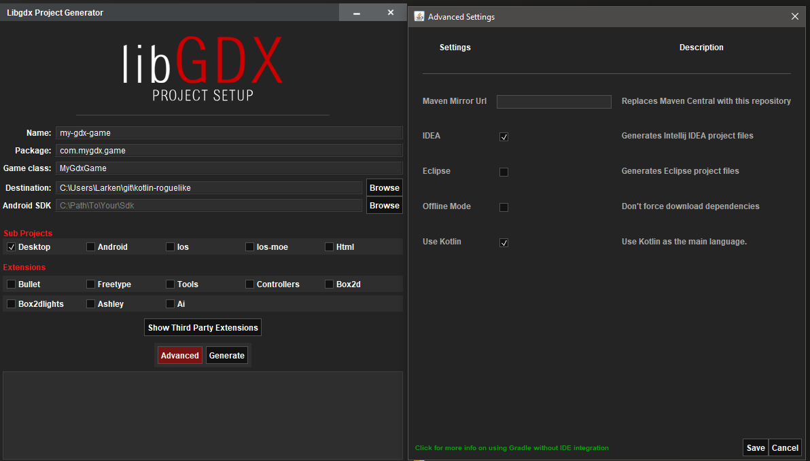
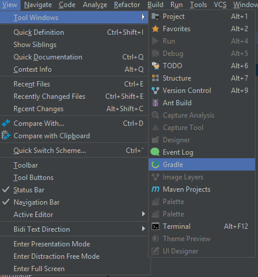
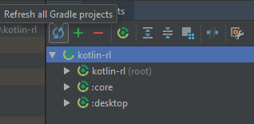
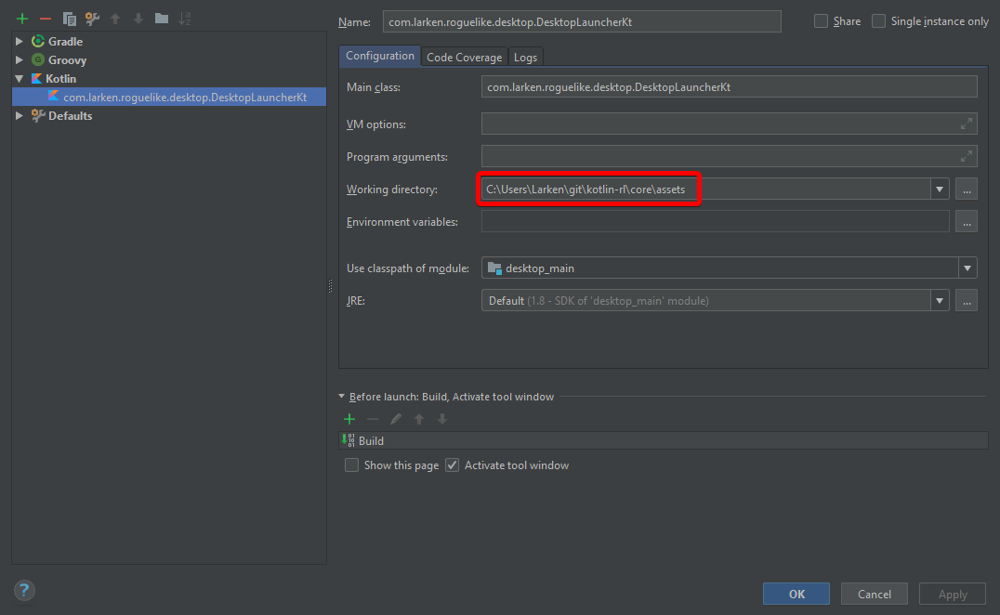

# Creating a Roguelike in Kotlin, KTerminal, and KDX (LibGDX bindings for Kotlin)

## Part 0 - Setting up your project

### Introduction
This tutorial series will be about how to create a roguelike using the Kotlin programming language.
For those who aren't familiar with Kotlin, Kotlin a language that compiles down
to Java bytecode. It can import existing Java libraries like LibGDX and Squidlib.
Some of the reasons you might want to use Kotlin over Java is that it has inferred
types and functional programming features that allow for rapid development.

### IDE & LibGDX Project Setup App
For this tutorial, I will be using the IntelliJ Community Edition IDE.
To get started, you'll want to download the [LibGDX project starter tool](https://libgdx.badlogicgames.com/download.html), run the
tool by opening the JAR, and create a new project. I am only going to cover how to create a Desktop project in this tutorial. 
You will also need to open up the *Advanced* settings and check *Use Kotlin*. 

<!-- Show screenshot of libgdx set up options -->


Once you set up your project, you'll want to import the project into Intellij by opening Intellij,
and selecting import project as a Gradle project. You may need to open up the Gradle window in IntelliJ and run Refresh All Projects. It
can be found under `View > Tool Windows > Gradle`.





Once the gradle build finishes, you should be able to build your project and run the Desktop Application
class under `desktop\src\com\mygdx\game\desktop\DesktopLauncher.java` and it will open up the LibGDX starter application. If you have
an error that says something about not being able to find a file, you will need to edit your run configuration
and set the working directory to be your `core/assets` folder - that way you can refer to any assets like a font sheet image
with a relative path.



If you did everything right, when you run the main method of the DesktopLauncher class it should show a window that looks
like this:


### Adding SquidLib and KTerminal Dependencies via Gradle
Gradle is used to manage the dependencies for your project.
You can add new libraries from git repositories by opening your `build.gradle` in the root project directory. We will be using
[KTerminal](https://github.com/heatherhaks/kterminal) and [SquidLib](https://github.com/SquidPony/SquidLib).
To add dependencies, you will need to add a new maven repostiory to under `allprojects` and add 
a compile command under the `core` and `desktop` in your `build.gradle`...


```
// under all projects and repostioroes, add the jitpack maven repository so that it can find our two dependencies
allprojects {
        repositories {
            ...
            maven { url 'https://jitpack.io' }
        }
}
```

```
// add the compile command under both core and desktop for squidlib and kterminal
project(":desktop") {
    // ...
    dependencies {
        compile project(":core")
        // ...
        compile 'com.github.heatherhaks:kterminal:-SNAPSHOT'
        compile 'com.squidpony:squidlib-util:3.0.0-b9'
    }
}
```

After adding your new gradle dependencies, you'll want to repeat an earlier step to get the new libraries pulled down:
> You may need to open up the Gradle window in IntelliJ and run Refresh All Projects. It
  can be found under `View > Tool Windows > Gradle`.

### Converting the LibGDX starter kit to use Kotlin
Up until now, we have just been using the Java starter kit for LibGDX. To start using Kotlin, we can use IntelliJ's 
`Convert to Java File to Kotlin` feature to roughly translate our code into Kotlin code! You'll need to open up your
main game class that you created during the LibGDX project set up under `core/src/com/mygdx/game` and select `Code > Convert to Java File to Kotlin`.
You'll need to do this for your main `Game` class and the `DesktopLauncher`. When it's all said and done, it should look like this:

```kotlin
/* DesktopLauncher.kt */
package com.mygdx.game.desktop

import com.badlogic.gdx.backends.lwjgl.LwjglApplication
import com.badlogic.gdx.backends.lwjgl.LwjglApplicationConfiguration
import com.mygdx.game.MyGdxGame

object DesktopLauncher {
    @JvmStatic
    fun main(arg: Array<String>) {
        val config = LwjglApplicationConfiguration()
        LwjglApplication(MyGdxGame(), config)
    }
}
```

```kotlin
/* MyGdxGame.kt */
package com.mygdx.game

import com.badlogic.gdx.ApplicationAdapter
import com.badlogic.gdx.Gdx
import com.badlogic.gdx.graphics.GL20
import com.badlogic.gdx.graphics.Texture
import com.badlogic.gdx.graphics.g2d.SpriteBatch

class MyGdxGame : ApplicationAdapter() {
    lateinit var batch: SpriteBatch
    lateinit var img: Texture

    override fun create() {
        batch = SpriteBatch()
        img = Texture("badlogic.jpg")
    }

    override fun render() {
        Gdx.gl.glClearColor(1f, 0f, 0f, 1f)
        Gdx.gl.glClear(GL20.GL_COLOR_BUFFER_BIT)
        batch.begin()
        batch.draw(img, 0f, 0f)
        batch.end()
    }

    override fun dispose() {
        batch.dispose()
        img.dispose()
    }
}

```

Be sure to run the `DesktopApplication`'s main method again to make sure our project still works. If so, we're ready to actually start
making the roguelike!

<!--[Go to part 1 - Drawing the '@' symbol and moving it around](../part1/part1.md)-->