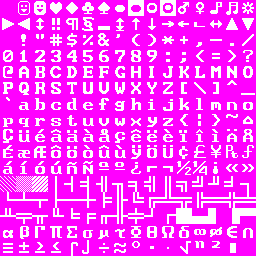
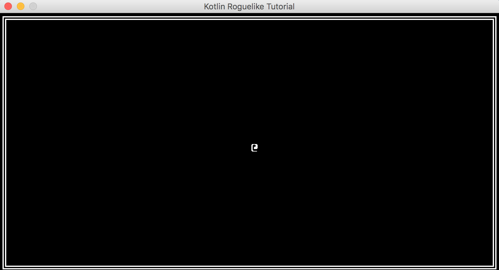
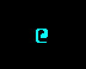
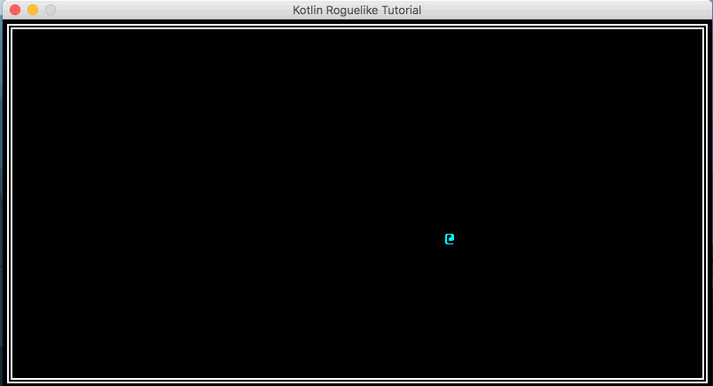

# Creating a Roguelike in Kotlin, KTerminal, and LibGDX

## Part 1 -  Drawing the '@' symbol and moving it around
In this part of the tutorial, we'll learn about how we can use KTerminal to draw characters to the screen and add input handling to move and keep track of the player position.

### Setup the height and width of the desktop launcher window
Before we dive in, let's set up some of the configuration for `DesktopLauncher.kt` so that our game displays properly. Set the following properties for the `config` object. We're just setting the width, height, fps, and title of the window:
```kotlin
object DesktopLauncher {
    @JvmStatic
    fun main(arg: Array<String>) {
        val config = LwjglApplicationConfiguration()
        config.title = "Kotlin Roguelike Tutorial"
        config.width = 800
        config.height = 416
        config.backgroundFPS = 60
        config.foregroundFPS = 60
        config.resizable = false
        LwjglApplication(MyGdxGame(), config)
    }
}
```

### LibGDX Application Adapter - High Level Overview
Since we are using LibGDX, it's important to understand briefly what a LibGDX application is doing. There are three major components that we'll be using in this tutorial, and those are the three methods that we're overriding from the base `ApplicationAdapter` class. The three methods are `create`, `render`, and `dispose`. The `create` function is called once to instantiate all our games' properties, like loading assets, creating our terminal renderer, setting some of the initial "engine" to run our game. The `render` function is called every frame and this is where we put our code to re-draw the game. Lastly, the `dispose` function is called when the application is destroyed, and it unloads the assets & the sprite batch. We'll be writing code in these three functions to:
1) `create` - create the terminal renderer & the data structure to keep track of where to draw characters
2) `render` - place ascii glyphs in the terminal data, then render the terminal data to the terminal renderer
3) `dispose` - dispose of our spritebatch and terminal renderer when we're done with it

### Getting a font sheet
First, we'll need to download a font sheet. This is what KTerminal uses to render the ASCII sprites, so we're not actually *writing* characters to the screen, but rather drawing the sprite from a font sheet. This is very common and something that Dwarf Fortress does too! You can download one [here](fontSheet.png) as a part of the tutorial, or find one online. Once you've downloaded it, place it in `core/assets`. You can remove the `badlogic.jpg` image file there as well.



### Creating a Terminal Renderer & Data, and Disposing of Resources
To get started, we'll need to open `MyGdxGame.kt`. We're going to add the following imports to the top of our kotlin file.
```kotlin
import com.halfdeadgames.kterminal.KTerminalData
import com.halfdeadgames.kterminal.KTerminalGlyph
import com.halfdeadgames.kterminal.KTerminalRenderer
```

This will allow us to create a terminal and render glyphs. Just after declaring our `MyGdxGame` class, we're going to add a few new `lateinit` properties for KTerminal. We can also get rid of the `img` property because we'll no longer be needing it. In addition to the Kterminal properties, we're also going to add an `InputAdapter` property from LibGDX so that later we can begin handling key events. We'll also add the width and height of the display to the properties as well.

```kotlin
class MyGdxGame : ApplicationAdapter() {
    lateinit var batch: SpriteBatch
    lateinit var terminalData: KTerminalData
    lateinit var terminalRenderer: KTerminalRenderer
    var width = 50
    var height = 26
    // ...
}
```

Now that we've added these new properties to our class, we'll want to instantiate them in our `create()` method. Notice that we aren't initializing the properties (hence the `lateinit` qualifier for our class properties). This is because we want to initialize them in the `create` method, which is what LibGDX is using internally to make sure all of the assets are loaded and it's ready for our methods to begin using LibGDX's features.

In the `MyGdxGame.create` method, we're going to instantiate the SpriteBatch and KTerminalData. The `KTerminalData` constructor takes in a width and height, as well as a default foreground and background color. The `KTerminalRenderer` constructor takes in a string that refers to the name of our font sheet image, the scale, and the sprite batch we've created for LibGDX to use internally.
```kotlin
override fun create() {
    batch = SpriteBatch()
    // the width and height in characters of the display
    terminalData = KTerminalData(width, height, Color.WHITE, Color.BLACK) // using badlogic games colors constants
    terminalRenderer = KTerminalRenderer("fontSheet.png", 1f, batch)
}
```

Now that we've created and instantiated our properties, we can begin to use them in the `render` method. For now, our `MyGdxGame.render` method can look like this:
```kotlin
override fun render() {
    clearScreen(0f, 0f, 0f, 1f)
    terminalData.clearAll()
    terminalData.resetCursor()
    /*  Drawing Code goes here */
    /* End drawing code */
    batch.use {
        terminalRenderer.render(0f, 0f, terminalData)
    }
}
```
What we're doing here is clearing the screen, clearing all of the ASCII glyphs from the terminal data, then rendering whatever is in terminal data to the terminal renderer. Between the comment blocks is where we want to update `terminalData` with instructions on what we want to draw. First, let's make sure we're disposing of our assets properly in the `dispose` method:
```kotlin
override fun dispose() {
    spriteBatch.dispose()
    terminalRenderer.dispose()
}
```

### Drawing stuff to the screen!
Now we're ready for the fun part. Make sure you can still launch the application by running the main method of your `DesktopLauncher.kt` class. You should get a black screen with nothing rendered to it if it's working. Like in Part 0, if you have issues with being unable to find your `fontSheet.png`, then you may need to change the working directory of your run configurations to be `core/assets`.

To begin to render stuff, we'll want to start adding code between the draw code comment blocks we added in our render method. We can write an ASCII character to the screen by selecting the coordinates we want to write, and calling the `write` method on the `terminalData`. The `KTerminalData.write` method can accept many different arguments. We can simply write strings, with `write("@")`! We can draw it right in the middle of the screen by writing to `terminalData[width / 2, height / 2]`.

```kotlin
override fun render() {
    clearScreen(0f, 0f, 0f, 1f)
    terminalData.clearAll()
    terminalData.resetCursor()
    /*  Drawing Code goes here */
    terminalData[width / 2, height / 2].write("@")
    /* End drawing code */
    batch.use {
        terminalRenderer.render(0f, 0f, terminalData)
    }
}
```

KTerminal also has a few utility functions so that we can quickly draw common shapes too. For example, here's a way draw a box. You can set the different ASCII characters for the different corners and sides of the box:
```kotlin
terminalData[0,0].drawBox(
    width = width,
    height = height,
    topRight = KTerminalData.BOX_DOUBLE_DOWN_LEFT,
    bottomLeft = KTerminalData.BOX_DOUBLE_UP_RIGHT,
    bottomRight = KTerminalData.BOX_DOUBLE_UP_LEFT,
    topLeft = KTerminalData.BOX_DOUBLE_DOWN_RIGHT,
    horizontal = KTerminalData.BOX_DOUBLE_HORIZONTAL,
    vertical = KTerminalData.BOX_DOUBLE_VERTICAL
)
```

With the box and drawing the `@`, your game should now look like this:



Instead of drawing just a string to the terminal, we can also use a `KTerminalGlyph` to customize the foreground and background color.
```kotlin
terminalData[width / 2, height /2 ].write(KTerminalGlyph('@', Color.CYAN, Color.BLACK))
```


At this point, your code should roughly match [this commit's files](https://github.com/Larkenx/kotlin-roguelike-tutorial/blob/c67cdf6cd5e4ca9ac32e39d143e77491304f734a/core/src/com/mygdx/game/MyGdxGame.kt).

### Making the @ move around the screen
Now that we've got basic rendering down, we can move on to adding some input controls. First, we need to add a way for the game to keep track of the player's location. One possible way that we can do this is by adding a new property to the class that has a type of `Vector2` from LibGDX. This is exactly what it sounds like - it's just a vector of length 2. For us, that's our `x` and `y` location of the player. The reason we might want to use this data structure is that it comes with some nice utilities built into the class, like being able to add vectors together with `Vector2.add(anotherVector)`.

> One thing to note about LibGDX's `Vector2` data structure is that it uses floats for its elements. We'll need to handle this appropriately when grabbing the player position since we're drawing to integer coordinates. We're going to resolve this in Part 3, where we begin to abstract out the player as its own class!

While we're at it, we want to add another `lateinit` property for the LibGDX `InputAdapter`. At first, IntelliJ will throw some errors that a type of `InputHandler` is not found, but this is fine because we're about to add a new class to our project. Here's what your properties under the class declaration should like:

```kotlin
class MyGdxGame : ApplicationAdapter() {
    lateinit var batch: SpriteBatch
    lateinit var terminalData: KTerminalData
    lateinit var terminalRenderer: KTerminalRenderer
    var width = 50
    var height = 26

    lateinit var inputAdapter: InputHandler
    lateinit var playerPosition: Vector2
    fun playerX(): Int = playerPosition.x.toInt() // grabs the float x component from the vector2 and returns it as an int
    fun playerY(): Int = playerPosition.y.toInt() // grabs the float y component from the vector2 and returns it as an int
    // ...
}
```

#### Add an InputHandler class

Now, we're going to create a new class that extends LibGDX's `InputAdapter` class. Under `kotlin-roguelike-tutorial/core/src/com/mygdx/game`, create a new kotlin file/class called `InputHandler`. In this file, we're going to set up a `when` statement (very similar to a `switch` statement), that will properly update the game's `playerPosition` vector based on the movement. For practicality, feel free to copy/paste the following input handling code into your new class. It should be self-explanatory. Its constructor accepts and stores a reference to your game, and updates the player's location based on your movement.

```kotlin
package com.mygdx.game

import com.badlogic.gdx.Input
import com.badlogic.gdx.math.Vector2
import com.mygdx.game.MyGdxGame
import ktx.app.KtxInputAdapter

class InputHandler (val game: MyGdxGame) : KtxInputAdapter {
    val up = Vector2(0f, -1f)
    val down = Vector2(0f, 1f)
    val left = Vector2(-1f, 0f)
    val right = Vector2(1f, 0f)
    val ul = Vector2(-1f, -1f)
    val ur = Vector2(1f, -1f)
    val ll = Vector2(-1f, 1f)
    val lr = Vector2(1f, 1f)

    override fun keyUp(keycode: Int): Boolean {
        when (keycode) {
            // AWSD keys
            Input.Keys.W -> game.playerPosition.add(up)
            Input.Keys.S -> game.playerPosition.add(down)
            Input.Keys.A -> game.playerPosition.add(left)
            Input.Keys.D -> game.playerPosition.add(right)
            // VIM keys
            Input.Keys.K -> game.playerPosition.add(up)
            Input.Keys.J -> game.playerPosition.add(down)
            Input.Keys.H -> game.playerPosition.add(left)
            Input.Keys.L -> game.playerPosition.add(right)
            Input.Keys.Y -> game.playerPosition.add(ul)
            Input.Keys.U -> game.playerPosition.add(ur)
            Input.Keys.B -> game.playerPosition.add(ll)
            Input.Keys.N -> game.playerPosition.add(lr)
            // Arrow keys
            Input.Keys.UP -> game.playerPosition.add(up)
            Input.Keys.DOWN -> game.playerPosition.add(down)
            Input.Keys.LEFT -> game.playerPosition.add(left)
            Input.Keys.RIGHT -> game.playerPosition.add(right)
        }

        return true
    }
}
```

#### Hooking up the InputHandler class to LibGDX
> If you aren't familiar with movement controls typical to roguelikes, definitely checkout roguebasin's article on [keyboard controls](http://roguebasin.com/index.php?title=Preferred_Key_Controls)

The important piece here is that we need to hook up our new class which extends LibGDX's `KtxInputAdapter` class. We do this in the create method. We also need to instantiate the `inputAdapter` and `playerPosition` properties. When adding the files, IntelliJ should let you import the libgdx functions where appropriate. Here's what this should look like when it's all said and done:

```kotlin
override fun create() {
    batch = SpriteBatch()
    terminalData = KTerminalData(width, height, Color.WHITE, Color.BLACK)
    terminalRenderer = KTerminalRenderer("fontSheet.png", 1f, batch)
    // set the player's location to be the middle of the screen
    playerPosition = Vector2(Math.floor(width / 2.0).toFloat(), Math.floor(height / 2.0).toFloat())
    inputAdapter = InputHandler(this) // create a new input handler with a reference to our game
    Gdx.input.inputProcessor = inputAdapter // set libgdx's input adapter to be the one we created
}
```

Finally, we just need to update our render method to put the player wherever the player position is. We added two new functions to get the `playerX` and `playerY`.
```kotlin
terminalData[playerX(), playerY()].write(KTerminalGlyph('@', Color.CYAN, Color.BLACK))
```

At this point, fire up your game and try moving your character around! You should be able to move in all 8 directions using vim keys or in the 4 cardinal directions with `wasd` or the arrow keys. At this point, your files [should look like this](https://github.com/Larkenx/kotlin-roguelike-tutorial/tree/5f12e1ce667a75d7d4b76a806215abd5d43f006c/core/src/com/mygdx/game).

